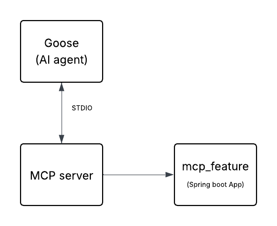

# Model Context Protocol (MCP) + Spring Boot Integration

## 🔗 Useful Links

- **MCP Introduction**: [modelcontextprotocol.io/introduction](https://modelcontextprotocol.io/introduction)  
- **Spring AI MCP Documentation**: [docs.spring.io - MCP Client Boot Starter](https://docs.spring.io/spring-ai/reference/api/mcp/mcp-client-boot-starter-docs.html)  
- **Goose (AI Agent) - Client Setup**: [block.github.io/goose](http://block.github.io/goose/)

---

## How to Run Your Spring Boot Application with Goose

### Step 1: Create JAR File

Build your Spring Boot application using:

```bash
./gradlew clean build
```

The JAR will be located in `target/`.

### Step 2: Install and Set Up Goose

Follow the [official Goose documentation](http://block.github.io/goose/) to install and configure the AI Agent.

---

## Running Goose with WSL (Windows Subsystem for Linux)

If you're using WSL and face issues running Goose sessions, follow these steps:

### 1. Create a Shell Script

Inside your WSL terminal, create a file named `run-extension.sh`:

```bash
nano run-extension.sh
```

Paste the following content:

```bash
#!/bin/bash
java -jar "FULL_PATH_OF_JAR_FILE/target/mcp_feature-0.0.1-SNAPSHOT.jar"
```

>  Replace `FULL_PATH_OF_JAR_FILE` with the actual path to your JAR file.

### 2. Ensure Java is Installed in WSL

If you encounter issues related to Java, ensure JDK is installed:

```bash
java -version
```

If not installed, you can install OpenJDK via:

```bash
sudo apt update
sudo apt install openjdk-21-jdk
```

### 3. Make the Script Executable

```bash
chmod +x run-extension.sh
```

### 4. Start Goose Session with Your Extension

```bash
goose session --with-extension="./run-extension.sh"
```

---

You're now ready to run your Spring Boot application integrated with MCP and the Goose AI Agent! 🧠🚀


Simple flow diagram : 


